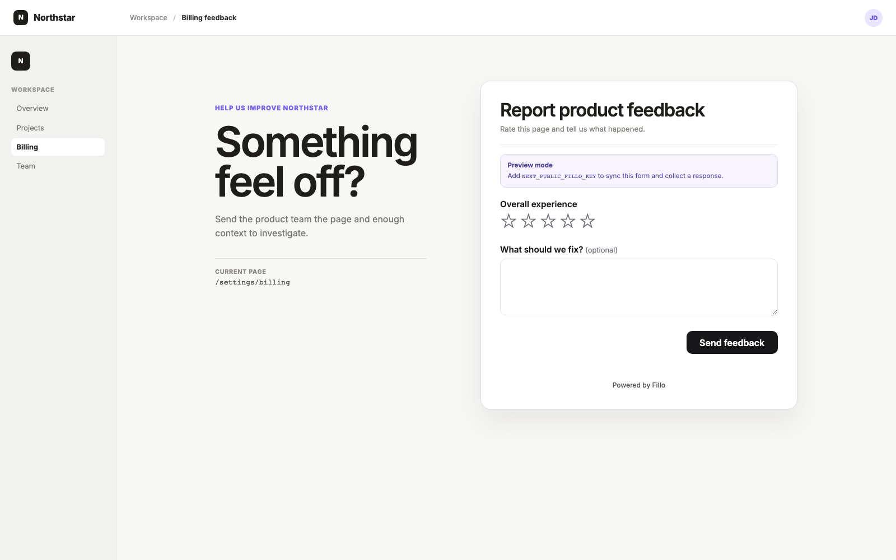
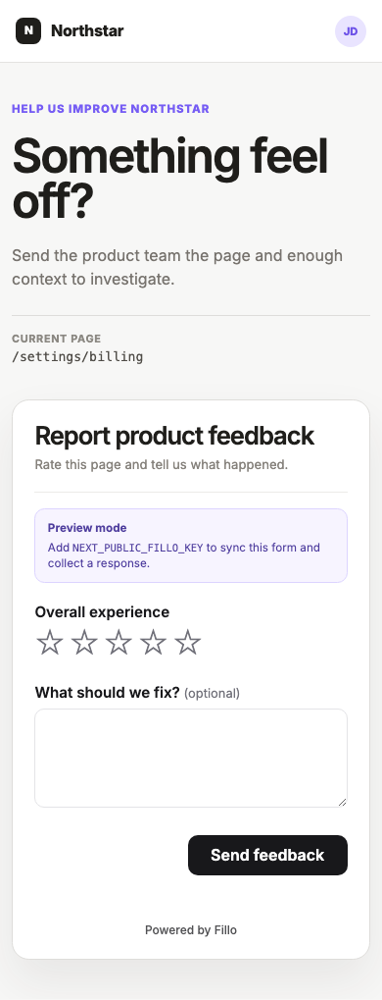

# Native in-app feedback for Next.js

[](https://github.com/jacobfunch/fillo-nextjs-feedback-starter/actions/workflows/ci.yml)

A small, production-shaped App Router example. The settings page belongs to the
host product; Fillo supplies the native form controls, shared schema, validation,
and accepted response.

[Read the implementation guide](https://fillo.so/guides/nextjs-in-app-feedback-form) ·
[React SDK](https://www.npmjs.com/package/@usefillo/react) ·
[Fillo docs](https://fillo.so/docs)



<details>
<summary>View the mobile layout</summary>
<br />

</details>

## What this starter proves

- Fillo renders real React controls inside an ordinary product route—no iframe.
- The form schema lives beside the UI as typed `<Fillo.Form>` JSX.
- A missing key opens a safe, non-submitting preview instead of a blank setup screen.
- A publishable `pk_` key can sync the code-defined form when workspace policy allows it.
- Private workspace, identity, and webhook secrets never enter the client bundle.

The whole example is intentionally small: one route, one form component, and one stylesheet.

## See the UI first

You do not need a Fillo account to inspect the native layout:

```bash
npm install
npm run dev
```

Open [http://localhost:3000](http://localhost:3000). Without an environment key,
the page labels itself **Preview mode** and disables submission. That state is
deliberate; it lets you review and style the UI without creating remote data.

## Collect the first real response

1. Create or open a workspace at [fillo.so](https://fillo.so).
2. Copy `.env.example` to `.env.local` and set `NEXT_PUBLIC_FILLO_KEY` to the
   workspace's public `pk_` key.
3. Add `http://localhost:3000` to the workspace's allowed origins.
4. Restart the dev server. Open the page once to sync `nextjs-settings-feedback`.
5. Review and publish the staged form in Fillo.
6. Trigger the required-rating error, then submit one safe test response.
7. Confirm the rating, note, source, and delivery state in the response workspace.

Published forms can be fetched and submitted by form ID without a publishable key.
This starter keeps the key because its schema is owned in code and needs to sync.

## Hand it to a coding agent

This repository includes [AGENTS.md](AGENTS.md) with the local architecture,
stable IDs, security boundaries, and verification checklist.

For the complete Fillo workflow, connect your existing account and install the
project skill from the repository root:

```bash
npx @usefillo/cli@latest login
npx @usefillo/cli@latest skill install
```

No workspace yet? Replace the login command with:

```bash
npx @usefillo/cli@latest agent bootstrap --email you@company.com
```

Then give your agent a concrete task:

> Use the build-with-fillo skill. Adapt this feedback card to the signed-in
> settings route in this repository. Keep the host layout, keep the stable
> `score` and `note` field IDs, add verified respondent identity only if the app
> already has a server-side user ID, run the production build, and tell me the
> exact publish and test steps that remain.

The skill works with Codex, Cursor, GitHub Copilot, Gemini CLI, Claude Code, and
other compatible coding agents. See [Fillo's agent setup](https://fillo.so/agents)
for installation paths and MCP options.

## Repository map

| Path | Responsibility |
| --- | --- |
| `app/page.tsx` | Product-owned settings route and surrounding layout |
| `app/FeedbackCard.tsx` | Code-defined Fillo schema, preview fallback, and embed |
| `app/styles.css` | Host-product layout plus local Fillo overrides |
| `app/layout.tsx` | Global Fillo stylesheet and page metadata |
| `AGENTS.md` | Instructions and acceptance checks for coding agents |
| `.github/workflows/ci.yml` | Clean-install and production-build check for every pull request |

## Customize without breaking the data contract

- Change headings, helper copy, colors, and placement freely.
- Treat `nextjs-settings-feedback`, `score`, and `note` as stored-data IDs after launch.
- Keep conditional behavior in the schema instead of conditionally adding fields in React.
- Compute respondent HMACs on the server; never expose the identity secret through `NEXT_PUBLIC_`.
- Use `onSubmitted` for local UI follow-up and a signed webhook for durable backend delivery.

## Production check

```bash
npm run build
```

Then inspect desktop and mobile layouts, keyboard focus, required-field errors,
the success state, and the accepted response in Fillo. Rendering the form is not
proof that the response workflow is complete.

## Learn the boundaries

- [Next.js feedback guide](https://fillo.so/guides/nextjs-in-app-feedback-form)
- [Native form request lifecycle](https://fillo.so/guides/native-form-request-lifecycle)
- [Respondent identity](https://fillo.so/docs/respondents)
- [Styling the React renderer](https://fillo.so/docs/styling)
